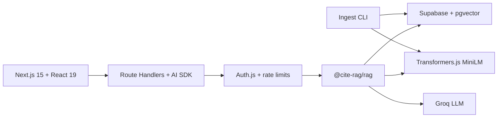

# cite-rag

Production-style **citation-backed RAG**: ingest 1,000+ docs → chunk → embed → pgvector retrieve → grounded answers with openable sources — or refuse when retrieval is weak. Offline MiniLM ablations measure Hit@k / MRR, chunking tradeoffs, reranking, and abstention quality on a fixed quiz set.

**Live:** https://cite-rag.vercel.app  
**Repo:** https://github.com/tanmays0/cite-rag

> Built a citation-backed RAG system with grounding/refusal behavior, then experimentally evaluated chunking and retrieval strategies using a reproducible MiniLM benchmark (30 questions). On the fixture corpus, **Fixed 512 / 12%** reached **Hit@1 90.9%**, **Hit@5 100%**, **MRR 0.955** (vs baseline Fixed 640 / 12% at Hit@1 **81.8%** / MRR **0.902**). A cross-encoder reranker did not change ranking metrics on this set while adding ~175ms/query. OOD refusal stayed at **100% (8/8)**; false refusals were **36.4%** under the default distance gate.

[](https://nextjs.org/)
[](https://react.dev/)
[](https://www.typescriptlang.org/)
[](https://sdk.vercel.ai/)
[](https://github.com/pgvector/pgvector)
[](https://supabase.com/)
[](https://groq.com/)
[](https://authjs.dev/)
[](https://orm.drizzle.team/)
[](https://huggingface.co/docs/transformers.js)
[](https://tailwindcss.com/)
[](https://cite-rag.vercel.app)

## Tech stack

| Layer | What ships |
| --- | --- |
| **Frontend** | Next.js 15 App Router, React 19, TypeScript, Tailwind CSS 4, Motion, Lenis |
| **API** | Next.js Route Handlers, Vercel AI SDK streaming, Zod validation |
| **Auth & limits** | Auth.js (email/password signup + guest sessions), per-route rate limiting |
| **RAG core** | Monorepo package `@cite-rag/rag` — chunk, retrieve, ground, cite |
| **Vectors** | Supabase Postgres + **pgvector** (HNSW / cosine, 384-d) |
| **Embeddings** | In-process **Transformers.js** `all-MiniLM-L6-v2` (free); optional OpenAI |
| **LLM** | Groq `openai/gpt-oss-20b` via AI SDK |
| **ORM / DB** | Drizzle ORM, offline CLI ingest (1,000+ docs, resume-safe) |
| **Uploads** | PDF/TXT parse, optional Vercel Blob |
| **Evals** | MiniLM Hit@1/3/5 + MRR, chunking ablation A–G, optional cross-encoder rerank, OOD/false-refusal scorecard |
| **Ops** | Docker Compose (local Postgres + pgvector), Vercel production |

## Architecture



## Quick start

```bash
cp .env.example .env.local
docker compose up -d db
pnpm install
pnpm --filter @cite-rag/rag build
pnpm db:migrate
pnpm db:seed-demo
pnpm dev
```

Open `/` and click **Try it now** for a one-click guest session, or **Sign up** / **Log in** for a persistent account. Guest uploads are isolated and purged after ~48 hours.

## Corpus ingest (1,000+ docs)

Bulk ingest runs as an offline CLI (avoids serverless timeouts).

**Synthetic demo corpus**

```bash
pnpm corpus:generate
pnpm corpus:ingest -- --source synthetic --limit 1000
```

**Simple English Wikipedia (CC BY-SA)**

```bash
pnpm corpus:ingest -- --limit 1000
```

- Chunking: ~640 tokens, ~12% overlap  
- Embeddings: MiniLM by default (`EMBEDDING_PROVIDER=openai` optional)  
- Resume-safe: existing `ready` `source_uri` rows are skipped  

**Production**

```bash
set -a && source .env.production.local && set +a
pnpm corpus:ingest -- --source synthetic --limit 1000
curl -s https://cite-rag.vercel.app/api/corpus/stats
```

Verified after synthetic ingest + fixtures: **1003 documents** / **1003 chunks**.

## Retrieval Evaluation

Offline eval uses the **same MiniLM model** as the app (`Xenova/all-MiniLM-L6-v2`) and cosine-distance ranking equivalent to pgvector `<=>`, over an in-process index of the three fixture docs (no 1k re-ingest).

| Item | Value |
| --- | --- |
| Dataset | [`evals/questions.jsonl`](./evals/questions.jsonl) — 22 grounded + 8 OOD |
| Embedding | `Xenova/all-MiniLM-L6-v2` (384-d) |
| Metrics | Hit@1, Hit@3, Hit@5, MRR (grounded only) |
| Gate | cosine distance threshold `0.55` |
| Artifacts | [`evals/scorecard.md`](./evals/scorecard.md), [`evals/ablation.md`](./evals/ablation.md), [`evals/results/`](./evals/results/) |

```bash
pnpm eval              
pnpm eval:ablation     
```

`EVAL_HASH_EMBEDDINGS=1` is **smoke only — not representative of retrieval quality**.

Numbers below are from run `2026-09-23T00-29-47-761Z` (regenerate with `pnpm eval:ablation`).

### Best vector config (C — Fixed 512 / 12%)

| Metric | Value |
| --- | --- |
| Hit@1 | 90.9% (20/22) |
| Hit@3 | 100.0% (22/22) |
| Hit@5 | 100.0% (22/22) |
| MRR | 0.955 |

## Chunking Ablation

Same docs, questions, MiniLM model, and top-5 evaluation; only chunking changes.

| Configuration | Hit@1 | Hit@3 | Hit@5 | MRR | ID |
| --- | --- | --- | --- | --- | --- |
| Fixed 640 / 12% | 81.8% | 100.0% | 100.0% | 0.902 | A |
| Fixed 256 / 12% | 90.9% | 100.0% | 100.0% | 0.939 | B |
| Fixed 512 / 12% | 90.9% | 100.0% | 100.0% | 0.955 | C |
| Fixed 1024 / 12% | 90.9% | 100.0% | 100.0% | 0.955 | D |
| Fixed 640 / 0% | 90.9% | 100.0% | 100.0% | 0.955 | E |
| Fixed 640 / 25% | 81.8% | 100.0% | 100.0% | 0.894 | F |
| Semantic ~400–600 / 10% | 90.9% | 100.0% | 100.0% | 0.955 | G |

Best by **MRR → Hit@5 → Hit@1**: **C** (tied with D/E/G on MRR; first among ties).

## Reranking

Cross-encoder `Xenova/ms-marco-MiniLM-L-6-v2` on vector top-20 → top-5, applied to best config **C**:

| Configuration | Hit@1 | Hit@3 | Hit@5 | MRR | Avg latency (ms) |
| --- | --- | --- | --- | --- | --- |
| Best vector (Fixed 512 / 12%) | 90.9% | 100.0% | 100.0% | 0.955 | 2 |
| Best + reranker | 90.9% | 100.0% | 100.0% | 0.955 | 169 |

Reranking did **not** improve Hit@k or MRR on this quiz; it added ~167ms per question on average. Left eval-only (not wired into production chat).

## Grounding & OOD Evaluation

Measured on best vector config **C** (separate from Hit@k):

| Metric | Value |
| --- | --- |
| OOD refusal correctness | 100.0% (8/8) |
| False refusal rate | 36.4% (8/22) |
| Citation presence (gate-pass) | 100.0% (14/14) |

## Findings

- Mid-size fixed chunks (**512 / 12%**) improved Hit@1 from **81.8% → 90.9%** and MRR from **0.902 → 0.955** versus the production-like baseline (**640 / 12%**).
- Raising overlap from **12% → 25%** at 640 tokens did **not** help (MRR **0.894**, worst in the grid).
- **Semantic packing** matched the best MRR (**0.955**) but did not beat Fixed 512 on this fixture set.
- **Reranking** preserved metrics and increased latency; not justified here.
- The distance gate refused all OOD questions, but **false-refused 36.4%** of grounded questions — a real tradeoff worth tuning separately from chunking.

Full tables and per-question evidence: [`evals/ablation.md`](./evals/ablation.md), [`evals/results/`](./evals/results/).

## Layout

```text
apps/web           Next.js UI + API routes
packages/rag       chunk / ground / cite / rerank library
data/scripts       corpus ingest CLI
data/fixtures      eval + seed fixtures
evals/             quiz, ablation runner, scorecards, results JSON
specs/             product specification
docs/              constitution
docker-compose.yml
```

## Environment

[`.env.example`](./.env.example) · [`DEPLOY.md`](./DEPLOY.md)

## License

MIT
