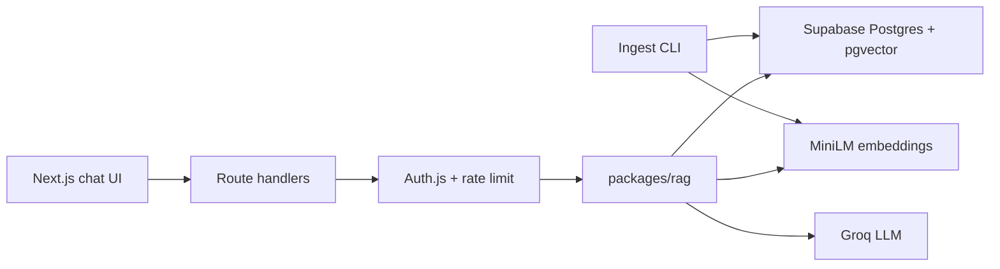

# cite-rag

Citation-backed RAG chatbot over 1,000+ documents: chunk → embed → retrieve → answer with inline citations, or refuse when retrieval is weak.

**Live demo:** https://cite-rag.vercel.app  
**Author:** Tanmay Shinde

| Layer | Stack |
| --- | --- |
| App | Next.js 15 (App Router), TypeScript, Tailwind CSS |
| RAG | `@cite-rag/rag` — chunk, retrieve, ground, cite |
| Vectors | Supabase Postgres + pgvector (384-d) |
| Embeddings | `Xenova/all-MiniLM-L6-v2` (optional OpenAI) |
| LLM | Groq `openai/gpt-oss-20b` |
| Auth | Auth.js credentials + demo account |
| Deploy | Vercel + Supabase — [DEPLOY.md](./DEPLOY.md) |

## Architecture



## Quick start

```bash
cp .env.example .env.local
docker compose up -d db
pnpm install
pnpm --filter @cite-rag/rag build
pnpm db:migrate
pnpm db:seed-demo
pnpm dev
```

Sign in with **Use demo account**, then open Chat.

Demo credentials: `demo@cite-rag.app` / `demo-cite-rag-2026`

## Corpus ingest (1,000+ docs)

Bulk ingest runs as an offline CLI (avoids serverless timeouts).

**Synthetic demo corpus**

```bash
pnpm corpus:generate
pnpm corpus:ingest -- --source synthetic --limit 1000
```

**Simple English Wikipedia (CC BY-SA)**

```bash
pnpm corpus:ingest -- --limit 1000
```

- Chunking: ~640 tokens, ~12% overlap  
- Embeddings: MiniLM by default (`EMBEDDING_PROVIDER=openai` optional)  
- Resume-safe: existing `ready` `source_uri` rows are skipped  

**Production**

```bash
set -a && source .env.production.local && set +a
pnpm corpus:ingest -- --source synthetic --limit 1000
curl -s https://cite-rag.vercel.app/api/corpus/stats
```

Verified after synthetic ingest + fixtures: **1003 documents** / **1003 chunks**.

## Evals

```bash
pnpm eval
```

Scorecard: [`evals/scorecard.md`](./evals/scorecard.md)

| Metric | Definition |
| --- | --- |
| hit-rate@k | Expected source appears in top-k |
| citation presence | Grounded answers expose citations |
| refusal correctness | OOD questions fail the grounding gate |

Published offline scorecard (hash-embedding smoke): refusal correctness **100% (8/8 OOD)**. Retrieval hit-rate requires a MiniLM- or OpenAI-embedded corpus.

## Layout

```text
apps/web           Next.js UI + API routes
packages/rag       chunk / ground / cite library
data/scripts       corpus ingest CLI
data/fixtures      local smoke fixtures
evals/             quiz set + scorecard
specs/             product specification
docs/              constitution
docker-compose.yml
```

## Environment

[`.env.example`](./.env.example) · [`DEPLOY.md`](./DEPLOY.md)

## License

MIT
