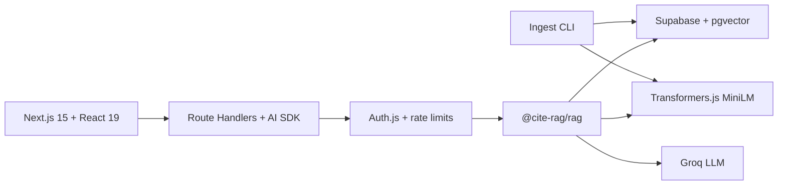

# cite-rag

Production-style **citation-backed RAG**: ingest 1,000+ docs → chunk → embed → pgvector retrieve → grounded answers with openable sources — or refuse when retrieval is weak.

**Live:** https://cite-rag.vercel.app  
**Repo:** https://github.com/tanmays0/cite-rag

[](https://nextjs.org/)
[](https://react.dev/)
[](https://www.typescriptlang.org/)
[](https://sdk.vercel.ai/)
[](https://github.com/pgvector/pgvector)
[](https://supabase.com/)
[](https://groq.com/)
[](https://authjs.dev/)
[](https://orm.drizzle.team/)
[](https://huggingface.co/docs/transformers.js)
[](https://tailwindcss.com/)
[](https://cite-rag.vercel.app)

## Tech stack

| Layer | What ships |
| --- | --- |
| **Frontend** | Next.js 15 App Router, React 19, TypeScript, Tailwind CSS 4, Motion, Lenis |
| **API** | Next.js Route Handlers, Vercel AI SDK streaming, Zod validation |
| **Auth & limits** | Auth.js (credentials + demo user), per-route rate limiting |
| **RAG core** | Monorepo package `@cite-rag/rag` — chunk, retrieve, ground, cite |
| **Vectors** | Supabase Postgres + **pgvector** (HNSW / cosine, 384-d) |
| **Embeddings** | In-process **Transformers.js** `all-MiniLM-L6-v2` (free); optional OpenAI |
| **LLM** | Groq `openai/gpt-oss-20b` via AI SDK |
| **ORM / DB** | Drizzle ORM, offline CLI ingest (1,000+ docs, resume-safe) |
| **Uploads** | PDF/TXT parse, optional Vercel Blob |
| **Evals** | Hit-rate@k, citation presence, OOD refusal scorecard |
| **Ops** | Docker Compose (local Postgres + pgvector), Vercel production |

## Architecture



## Quick start

```bash
cp .env.example .env.local
docker compose up -d db
pnpm install
pnpm --filter @cite-rag/rag build
pnpm db:migrate
pnpm db:seed-demo
pnpm dev
```

Sign in with **Use demo account**, then open Chat.

Demo credentials: `demo@cite-rag.app` / `demo-cite-rag-2026`

## Corpus ingest (1,000+ docs)

Bulk ingest runs as an offline CLI (avoids serverless timeouts).

**Synthetic demo corpus**

```bash
pnpm corpus:generate
pnpm corpus:ingest -- --source synthetic --limit 1000
```

**Simple English Wikipedia (CC BY-SA)**

```bash
pnpm corpus:ingest -- --limit 1000
```

- Chunking: ~640 tokens, ~12% overlap  
- Embeddings: MiniLM by default (`EMBEDDING_PROVIDER=openai` optional)  
- Resume-safe: existing `ready` `source_uri` rows are skipped  

**Production**

```bash
set -a && source .env.production.local && set +a
pnpm corpus:ingest -- --source synthetic --limit 1000
curl -s https://cite-rag.vercel.app/api/corpus/stats
```

Verified after synthetic ingest + fixtures: **1003 documents** / **1003 chunks**.

## Evals

```bash
pnpm eval
```

Scorecard: [`evals/scorecard.md`](./evals/scorecard.md)

| Metric | Definition |
| --- | --- |
| hit-rate@k | Expected source appears in top-k |
| citation presence | Grounded answers expose citations |
| refusal correctness | OOD questions fail the grounding gate |

Published offline scorecard (hash-embedding smoke): refusal correctness **100% (8/8 OOD)**. Retrieval hit-rate requires a MiniLM- or OpenAI-embedded corpus.

## Layout

```text
apps/web           Next.js UI + API routes
packages/rag       chunk / ground / cite library
data/scripts       corpus ingest CLI
data/fixtures      local smoke fixtures
evals/             quiz set + scorecard
specs/             product specification
docs/              constitution
docker-compose.yml
```

## Environment

[`.env.example`](./.env.example) · [`DEPLOY.md`](./DEPLOY.md)

## License

MIT
